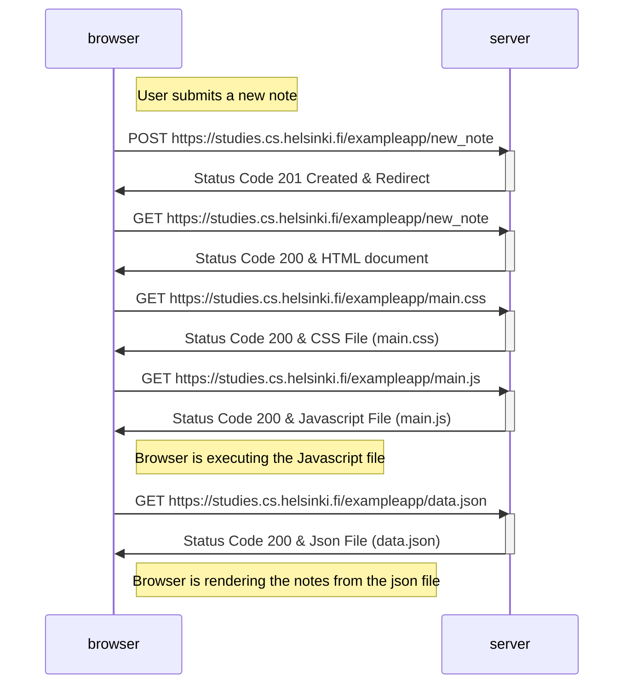

```mermaid
sequenceDiagram
    participant browser
    participant server

    Note right of browser: User submits a new note

    browser->>server: POST https://studies.cs.helsinki.fi/exampleapp/new_note
    activate server
    server->>browser: Status Code 201 Created & Redirect
    deactivate server

    browser->>server: GET https://studies.cs.helsinki.fi/exampleapp/new_note
    activate server
    server->> browser: Status Code 200 & HTML document
    deactivate server

    browser->> server: GET https://studies.cs.helsinki.fi/exampleapp/main.css
    activate server
    server->> browser: Status Code 200 & CSS File (main.css)
    deactivate server

    browser->>server: GET https://studies.cs.helsinki.fi/exampleapp/main.js
    activate server
    server->>browser: Status Code 200 & Javascript File (main.js)
    deactivate server

    Note right of browser: Browser is executing the Javascript file

    browser->>server: GET https://studies.cs.helsinki.fi/exampleapp/data.json
    activate server
    server->>browser: Status Code 200 & Json File (data.json)
    deactivate server

    Note right of browser: Browser is rendering the notes from the json file


```